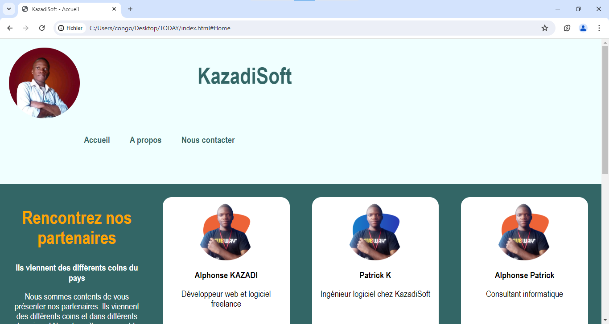

# KazadiSoft

Welcome to the KazadiSoft repository! This repository hosts the code for a responsive website designed for KazadiSoft, a dynamic web agency specializing in cutting-edge web solutions.

## Overview

This repository contains the complete source code for the KazadiSoft website. It's built to showcase the services provided by KazadiSoft and provide a platform for potential clients to get in touch.

## Key Features

- **Responsive Design**: The website is optimized to deliver a seamless user experience across various devices and screen sizes.
- **Service Showcase**: Explore the wide range of services offered by KazadiSoft, including web design, development, and digital marketing solutions.
- **Client Testimonials**: Read testimonials from satisfied clients who have experienced KazadiSoft's exceptional services.
- **Contact Information**: Easily find ways to get in touch with KazadiSoft for inquiries or consultations.

## Screenshots

## How to Contribute

We welcome contributions from the community to improve and enhance the KazadiSoft website. If you have any ideas, bug fixes, or new features to propose, please feel free to submit a pull request.

## License

This project is licensed under the MIT License. See the [LICENSE](LICENSE) file for details.

## Demo

[Demo](kazadisoft.vercel.app).

---

Thank you for your interest in KazadiSoft! We hope you find our website informative and inspiring.
